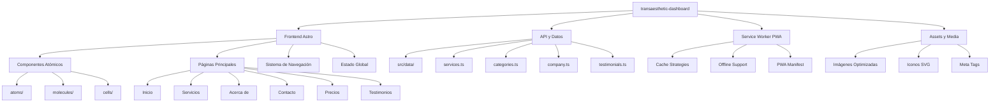

# 📋 Plan de Desarrollo - Transaesthetic Dashboard

## 🎯 Visión General

Proyecto de completitud y optimización del dashboard "transaesthetic-dashboard" construido con Astro, implementando todas las mejoras necesarias para una presentación profesional del producto terminado.

**Estado del Proyecto:** 🚧 En Desarrollo
**Framework:** Astro 5 + Tailwind CSS
**Objetivo:** Template flexible para múltiples empresas
**Plataforma de Despliegue:** Vercel

## 📊 Métricas de Éxito Esperadas

- **Lighthouse Score**: 95+ en todas las categorías
- **First Contentful Paint**: < 1.5s
- **Time to Interactive**: < 3s
- **Cumulative Layout Shift**: < 0.1
- **Funcionalidad offline**: 100%
- **Accesibilidad WCAG**: AA compliance
- **SEO Score**: 90+

---

## ✅ FASE 1: ANÁLISIS Y PREPARACIÓN DEL PROYECTO

### 1.1 Análisis del estado actual del proyecto
- [x] Revisar estructura de componentes atómicos existente
- [x] Analizar Service Worker implementado
- [x] Evaluar tipos TypeScript definidos
- [x] Revisar configuración de Astro y Tailwind
- [x] Identificar dependencias faltantes

### 1.2 Instalación de dependencias necesarias
- [ ] Instalar @astrojs/tailwind
- [ ] Instalar @astrojs/sitemap
- [ ] Instalar astro-icon
- [ ] Instalar lucide-astro
- [ ] Instalar @astrojs/mdx
- [ ] Instalar astro-compress
- [ ] Instalar rehype-autolink-headings
- [ ] Instalar remark-toc

### 1.3 Configuración del entorno de desarrollo
- [ ] Actualizar astro.config.mjs con nuevas integraciones
- [ ] Configurar variables de entorno
- [ ] Preparar estructura de carpetas para datos
- [ ] Configurar TypeScript para mejor desarrollo

---

## 📝 FASE 2: CREACIÓN DE CONTENIDO Y DATOS REALISTAS

### 2.1 Crear archivo de datos de servicios (src/data/services.ts)
- [ ] Definir interfaz Service completa
- [ ] Implementar 6 servicios realistas:
  - Consultoría Estratégica Premium
  - Desarrollo Web Full-Stack
  - Branding Corporativo Completo
  - Marketing Digital 360°
  - Auditoría de Seguridad TI
  - Sistema de Diseño UI/UX
- [ ] Incluir precios, categorías, características y metadatos

### 2.2 Crear categorías de servicios (src/data/categories.ts)
- [ ] Definir 4 categorías principales
- [ ] Asignar iconos Lucide para cada categoría
- [ ] Preparar estructura para filtrado

### 2.3 Crear datos de empresa (src/data/company.ts)
- [ ] Información de contacto
- [ ] Historia y misión
- [ ] Valores corporativos
- [ ] Estadísticas de éxito
- [ ] Información del equipo

### 2.4 Crear datos de testimonios (src/data/testimonials.ts)
- [ ] Testimonios reales de clientes
- [ ] Casos de éxito documentados
- [ ] Métricas de satisfacción
- [ ] Logos de empresas clientes

---

## 🌐 FASE 3: IMPLEMENTACIÓN DE PÁGINAS PRINCIPALES

### 3.1 Página de servicios completa (src/pages/servicios.astro)
- [ ] Grid completo usando ProductGrid existente
- [ ] Sistema de filtrado por categorías
- [ ] Funcionalidad de búsqueda
- [ ] Paginación si es necesario
- [ ] Meta tags específicos para SEO

### 3.2 Página "Acerca de" (src/pages/acerca-de.astro)
- [ ] Historia de la empresa
- [ ] Sección del equipo con fotos
- [ ] Misión, visión y valores
- [ ] Diferenciales competitivos
- [ ] Estadísticas de éxito

### 3.3 Página de contacto (src/pages/contacto.astro)
- [ ] Formulario de contacto funcional
- [ ] Información de contacto completa
- [ ] Mapa de ubicación
- [ ] Horarios de atención
- [ ] Enlaces a redes sociales

### 3.4 Página de precios (src/pages/precios.astro)
- [ ] Planes de precios diferenciados
- [ ] Comparativa de características
- [ ] Llamados a acción claros
- [ ] FAQ de precios

### 3.5 Página de testimonios (src/pages/testimonios.astro)
- [ ] Testimonios reales de clientes
- [ ] Casos de éxito detallados
- [ ] Métricas de satisfacción
- [ ] Logos de empresas clientes

---

## ⚡ FASE 4: MEJORAS DE FUNCIONALIDAD

### 4.1 Funcionalidad de carrito de compras
- [ ] Estado global del carrito
- [ ] Persistencia en localStorage
- [ ] Integración con ProductCard
- [ ] Página de checkout
- [ ] Cálculo de totales automáticos

### 4.2 Sistema de navegación mejorado
- [ ] Menú responsivo completo
- [ ] Breadcrumbs dinámicos
- [ ] Navegación por categorías
- [ ] Footer con enlaces importantes
- [ ] Navegación por teclado

### 4.3 Modo oscuro/claro
- [ ] Toggle en el header
- [ ] Persistencia de preferencia
- [ ] Variables CSS para ambos temas
- [ ] Transiciones suaves
- [ ] Detección automática del sistema

### 4.4 Sistema de filtrado y búsqueda
- [ ] Filtro por categorías
- [ ] Búsqueda por texto
- [ ] Filtros combinados
- [ ] Estado de filtros persistente
- [ ] Resultados en tiempo real

---

## 🚀 FASE 5: OPTIMIZACIONES DE RENDIMIENTO

### 5.1 Optimización del Service Worker
- [ ] Estrategias de cache específicas para APIs
- [ ] Cache First para assets estáticos
- [ ] Network First para contenido dinámico
- [ ] Stale While Revalidate para datos
- [ ] Background sync para datos pendientes

### 5.2 Lazy loading y optimización de imágenes
- [ ] Implementar loading="lazy" en todas las imágenes
- [ ] Usar formato WebP para mejor compresión
- [ ] Implementar srcset para diferentes tamaños
- [ ] Placeholder images durante carga
- [ ] Optimización automática de imágenes

### 5.3 Bundle optimization
- [ ] Code splitting para rutas
- [ ] Preloading de recursos críticos
- [ ] Minificación de assets
- [ ] Compresión gzip/brotli
- [ ] Tree shaking automático

### 5.4 Configuración de PWA avanzada
- [ ] Web App Manifest completo
- [ ] Iconos en múltiples tamaños
- [ ] Theme color y background color
- [ ] Shortcuts para acciones rápidas
- [ ] Install prompt nativo

---

## ♿ FASE 6: ACCESIBILIDAD Y SEO

### 6.1 Mejoras de accesibilidad
- [ ] Atributos ARIA en todos los componentes
- [ ] Navegación completa por teclado
- [ ] Contraste de colores WCAG AA
- [ ] Screen reader optimization
- [ ] Focus management automático

### 6.2 Optimización SEO completa
- [ ] Meta tags dinámicos por página
- [ ] Schema markup para servicios
- [ ] Open Graph para redes sociales
- [ ] Twitter Cards
- [ ] Sitemap automático actualizado

### 6.3 Schema markup y meta tags
- [ ] Schema.org para servicios
- [ ] Meta tags específicos por página
- [ ] Robots.txt optimizado
- [ ] Canonical URLs
- [ ] Rich snippets para mejor CTR

---

## 🔒 FASE 7: SEGURIDAD Y PWA

### 7.1 Configuración de seguridad
- [ ] Headers de seguridad en astro.config.mjs
- [ ] Content Security Policy
- [ ] HTTPS enforcement
- [ ] Protección contra XSS
- [ ] Sanitización de inputs

### 7.2 PWA avanzada con manifest
- [ ] Manifest.json completo
- [ ] Iconos PWA en múltiples tamaños
- [ ] Configuración de tema
- [ ] Shortcuts de navegación
- [ ] Install prompt personalizado

### 7.3 Configuración de headers de seguridad
- [ ] Security headers en Vercel
- [ ] CORS configuration
- [ ] HSTS headers
- [ ] X-Frame-Options
- [ ] X-Content-Type-Options

---

## 🧪 FASE 8: TESTING Y CALIDAD

### 8.1 Configuración de testing
- [ ] Unit tests para componentes
- [ ] Integration tests para páginas
- [ ] E2E tests con Playwright
- [ ] Lighthouse CI para métricas
- [ ] Accessibility testing automatizado

### 8.2 Testing manual y validación
- [ ] Cross-browser testing
- [ ] Responsive design testing
- [ ] Performance testing manual
- [ ] Accessibility audit manual
- [ ] PWA validation completa

### 8.3 Lighthouse CI y métricas
- [ ] Configuración de GitHub Actions
- [ ] Métricas automáticas de performance
- [ ] Monitoreo de accesibilidad
- [ ] Alertas de regresión
- [ ] Reportes automáticos

---

## 📚 FASE 9: DOCUMENTACIÓN Y DESPLIEGUE

### 9.1 Actualización del README.md
- [ ] Instrucciones de instalación detalladas
- [ ] Guía de desarrollo completa
- [ ] API documentation
- [ ] Deployment instructions
- [ ] Troubleshooting guide

### 9.2 Configuración de despliegue para Vercel
- [ ] GitHub Actions para CI/CD
- [ ] Environment variables
- [ ] Configuración de build
- [ ] Domain configuration
- [ ] Monitoring y analytics

### 9.3 Documentación técnica completa
- [ ] Guía de arquitectura
- [ ] Documentación de componentes
- [ ] API endpoints (si aplica)
- [ ] Database schema
- [ ] Deployment checklist

---

## 🎬 FASE 10: PREPARACIÓN PARA DEMO

### 10.1 Demo script y presentación
- [ ] Flujo de navegación completo
- [ ] Demostración de funcionalidades
- [ ] Casos de uso reales
- [ ] Puntos destacados del Service Worker
- [ ] Métricas de rendimiento en vivo

### 10.2 Assets para presentación
- [ ] Screenshots de alta calidad
- [ ] Video demo profesional
- [ ] Casos de estudio documentados
- [ ] Comparativas de rendimiento
- [ ] Testimonios de usuarios

### 10.3 Checklist final de calidad
- [ ] Validación de todas las funcionalidades
- [ ] Testing en múltiples dispositivos
- [ ] Verificación de performance
- [ ] Checklist de accesibilidad
- [ ] Checklist de SEO
- [ ] Checklist de PWA

---

## 🏗️ Arquitectura del Proyecto



---

## 📈 Progreso General

**Completado:** 2% (1/45 tareas)
**En Progreso:** Fase 1 - Análisis y preparación
**Siguientes:** Instalación de dependencias

### 🎯 Próximas Tareas Críticas

1. **Instalación de dependencias** - Necesario para continuar
2. **Configuración del entorno** - Base para desarrollo
3. **Creación de datos de servicios** - Contenido para páginas

---

## 📝 Notas de Desarrollo

- **Framework:** Astro 5 con Tailwind CSS 4
- **Estado:** Template flexible para múltiples empresas
- **Despliegue:** Optimizado para Vercel
- **PWA:** Service Worker con estrategias avanzadas de cache
- **SEO:** Optimización completa con meta tags dinámicos
- **Accesibilidad:** Cumplimiento WCAG AA

**Última actualización:** 21 de septiembre de 2025
**Versión del proyecto:** 0.0.1 → 1.0.0 (objetivo)

---

## 🚀 Comandos Útiles

```bash
# Desarrollo
npm run dev

# Build de producción
npm run build

# Preview de producción
npm run preview

# Testing
npm run test

# Deploy a Vercel
vercel --prod
```

---

**📞 Contacto del Equipo:**
Para dudas o soporte durante el desarrollo, revisar la documentación actualizada o contactar al equipo de desarrollo.

**🎯 Objetivo Final:**
Entregar un producto profesional, completamente funcional, optimizado para producción y listo para presentación a clientes o stakeholders.